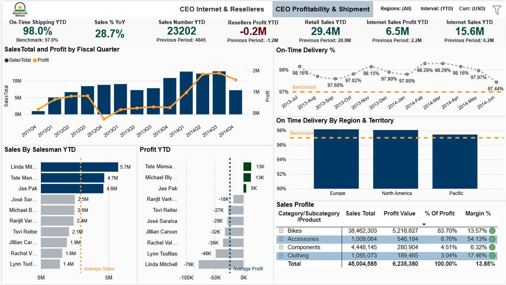

# CEO Dashboard Insights: Internet, Resellers, Profitability & Shipping

## Adventure Works CEO Dashboard Overview

### Introduction and Business Objectives

The **Adventure Works CEO dashboards** provide C-level executives with a unified overview of sales performance, profitability, and operational efficiency. The main objectives are:

- Assessing sales targets and growth trends  
- Comparing performance across sales channels (Internet vs. Reseller)  
- Reviewing regional and segment-level results  
- Ensuring customer satisfaction through on-time delivery

The dashboards are built to help the CEO:
- Track progress against targets  
- Review YoY trends, including seasonal effects  
- Drill into results by region, channel, product, or customer  
- See Internet & Reseller performance in one consolidated view  
- Monitor profit margins and the drivers/detractors of profitability  
- Track operational KPIs like on-time shipments

---

## Dashboard 1: CEO Internet & Resellers

### Purpose

This dashboard provides a **one-page summary** of all key sales metrics and trends, with an emphasis on the contribution of each channel (Internet vs. Reseller) and regional breakdowns. The design delivers a fast, comprehensive view of performance, channel mix, and regional strengths/weaknesses.

---

### KPI Overview (Sales & Profit Performance)

- **Key metrics at a glance:**  
  - **Sales vs Target (YTD):** $45.0M (Target: $53.1M)  
  - **Profit YTD:** $6.2M  
  - **Profit % YTD:** 13.9% (Prev. 2.8%)  
  - **Sales % YoY:** +28.7%  
  - **Retail (Reseller) Sales YTD:** $29.4M  
  - **Internet Sales YTD:** $15.6M (Prev. $6.2M)  

- **Color coding:**  
  - **Dark green:** Improvement  
  - **Dark red:** Underperformance

- **Business Questions Answered:**  
  - Are we on track for our sales goals?  
  - How do we compare to last year?  
  - How are Internet and Reseller channels performing side by side?

---

### Sales Trends & Channel Comparison

- **Quarterly sales trend (2011 Q4 – 2014 Q4):**  
  - Clustered bar & line chart:  
    - **Blue bars:** Online sales  
    - **Gray bars:** Reseller sales  
    - **Orange line:** Sales total  
  - Sales peaked Q4 2013–Q1 2014 (~$13M), with a seasonal dip Q4 2014 ($7M).
  - **Channel mix:** Internet share increases over time, illustrating the shift toward online sales.

---

### Regional Performance (Quota, Sales & Profit)

- **Resellers Quota vs Sales YTD:**  
  - *North America:* $21M sales vs $23M quota  
  - *Europe:* $7M sales vs $9M quota  
  - *Pacific:* $1M sales vs $2M quota  

- **Resellers Profit YTD:**  
  - All regions are negative:  
    - *North America:* –$107K  
    - *Europe:* –$81K  
    - *Pacific:* –$48K  

- **Internet vs Resellers Profit by Region YTD:**  
  - Internet is profitable in all regions (e.g., NA: $2.7M), while Reseller profits are negative or near zero.

- **Internet Sales YTD vs PYTD (by region):**  
  - *North America:* $6.3M (Current) vs $1.8M (Previous)  
  - *Europe:* $5.2M vs $2.1M  
  - *Pacific:* $4.1M vs $2.2M  

---

### Sales Forecast & Trend

- **Sales Forecast with Trend Line:**  
  - Historical monthly sales with 5-month forward forecast  
  - Black line: actuals, orange: forecast, gray band: 95% confidence interval  
  - Upward trend, forecast continues growth but with wider uncertainty

---

### Internet Sales Mix by Region

- **Internet Sales Ratio in Total Sales (by region):**  
  - Line chart shows increasing online share in all markets  
  - North America nearing 50% of sales from Internet  
  - Europe and Pacific also trending upward

---

### Interactive Filters

- **Filter panel for:**  
  - Timeframe (default: YTD)  
  - Currency (default: USD)  
  - Region  
- Allows drill-down and easy context switch for data exploration

---

## Key Insights

- **Sales Target Shortfall:**  
  - YTD sales ($45.0M) below target ($53.1M), but strong 28.7% YoY growth

- **Explosive Online Growth:**  
  - Internet Sales YTD more than doubled vs previous year ($15.6M vs $6.2M)

- **Reseller Channel Weakness:**  
  - Reseller profits negative across all regions (–$0.2M overall YTD)
  
- **Regional Standouts:**  
  - North America is the biggest market, leading in sales and online profit  
  - NA is approaching 50% Internet sales share

- **Upward Trend with Seasonal Variability:**  
  - Despite a dip in Q4 2014, overall growth trajectory is strong  
  - Forecast suggests continued improvement

---

## Value Delivered

The CEO dashboards enable:
- Fast comparison of Internet vs. Reseller sales and profits  
- Deep dives by region, channel, and time period  
- Clear identification of strengths (Internet growth, NA leadership) and risks (Reseller losses, missed targets)
- Strategic planning with integrated sales and profit forecasting

# Dashboard 2: CEO Profitability & Shipment

**Figure:** CEO Profitability & Shipment dashboard, focusing on profit drivers and on-time delivery.

This updated dashboard highlights profitability across channels (Reseller vs. Internet) and operational efficiency in shipments. The top section displays key performance indicators for on-time shipping, sales growth, sales volume, and profit by channel (Internet vs Reseller). Visuals include quarterly sales vs. profit trends, sales and profit by salesperson, on-time delivery trends (12-month rolling), regional on-time performance, and a product category profit breakdown. Together, these insights help identify where the company is making or losing money and whether shipping operations meet targets.

---

## Purpose

The **CEO Profitability & Shipment dashboard** provides a focused view on profitability and operational shipping performance. While the first dashboard compared channels and overall sales, this dashboard drills into profit contributions (by channel, product, and salesperson) alongside on-time delivery KPIs.

**Key Questions Answered:**
- Where are we making or losing profit?
- Are we delivering on time?

---

## KPI Overview (Profitability & Delivery Performance)

| Metric                   | Value (YTD)         | Previous Period      | Note                                                       |
|--------------------------|---------------------|---------------------|------------------------------------------------------------|
| On-Time Shipping         | 98.0%               | Benchmark: 97.0%    | Exceeds target, strong operations                          |
| Sales Growth (YoY)       | +28.7%              | -                   | Robust growth vs last year                                 |
| Sales Orders YTD         | 23,202              | 4,845               | Volume up sharply, operational capacity tested             |
| Reseller Profit YTD      | –$0.2M              | –$1.2M              | Loss reduced, but still negative                           |
| Reseller Sales YTD       | $29.4M              | $28.8M              | Slight increase                                            |
| Internet Profit YTD      | $6.5M               | $2.2M               | Nearly 3× growth, strong online channel                    |
| Internet Sales YTD       | $15.6M              | $6.2M               | Doubled YoY, drives sales growth                           |

- **Color coding:**  
  - Dark green: Favorable/improvement (e.g., on-time % above target, profit increases)
  - Dark red: Underperformance (e.g., negative profit, metrics below benchmark)

---

### Business Questions Answered

- Are shipments being delivered on time, and how do we compare to the on-time target?
- How does our current sales growth compare to last year?
- Is the Reseller channel now profitable? How does it compare to Internet in profit contribution?
- How many orders have we processed vs. last year, and can our operations handle the surge?

---

## Quarterly Sales & Profit Trend

- **Sales & Profit by Fiscal Quarter (2011 Q4 – 2014 Q4):**  
  - Clustered bar & line chart: bars = total sales per quarter, line = profit.
  - Sales peaked Q4 2013–Q1 2014 ($12–13M); Q4 2014 dropped to $7M.
  - Profit line follows sales, peaking at ~$1.8M early 2014, and improving year-over-year.
  - 2014 full-year profit margin: ~13.9% (vs. ~2.8% prior year).
  - Higher sales volume and better cost management drove stronger bottom line in 2014.

---

## Salesperson Performance (Sales YTD vs. Profit YTD)

- **Sales by Salesperson (YTD):**  
  - Top: Linda Mitchell ($5.7M), Tete Mensa-Annan ($4.7M), Jae Pak ($4.6M).
  - Average sales indicated with reference line.

- **Profit by Salesperson (YTD):**
  - Only a few reps have positive profit (green bars).
  - Most reps are negative (red bars).
    - Example: Tete Mensa-Annan leads profit (+$13K), Linda Mitchell's sales lost –$78K.
  - Average profit per rep is below zero.
  - *Insight:* High sales ≠ high profitability. Points to issues like discounting or high-cost products.

---

## On-Time Delivery Performance

- **Rolling 12-Month On-Time Delivery %:**  
  - Line chart, mostly in high 90s, showing consistent, excellent performance.
  - Dips to 97% briefly, then rebounds to 98%+.
  - Benchmark (orange line): 97%. Most months meet or exceed target.
  - *Takeaway:* Operations keep up with increased volume and maintain high standards.

- **On-Time Delivery by Region & Territory:**
  - North America: ~99%
  - Europe: ~98%
  - Pacific: 96–97% (slightly below target)
  - *Action:* Investigate Pacific region for possible improvement (e.g., carriers, customs).

---

## Sales Profile by Product Category

| Category      | Sales YTD | Profit YTD | % of Total Profit | Profit Margin |
|---------------|-----------|------------|-------------------|--------------|
| **Bikes**     | $38.46M   | $5.22M     | 83.7%             | 13.6%        |
| Accessories   | $1.01M    | $0.55M     | 8.8%              | 54.1%        |
| Components    | $4.45M    | $0.28M     | 4.5%              | 6.3%         |
| Clothing      | $1.09M    | $0.19M     | 3.0%              | 17.5%        |
| **Total**     | $45.00M   | $6.24M     | 100%              | 13.9%        |

- **Bikes:** Main revenue/profit driver (84% of profit), but only moderate margin (13.6%).
- **Accessories:** Small in sales, very high margin (54%). Big profit potential if grown.
- **Components:** Moderate revenue, low margin (6.3%).
- **Clothing:** Small category, modest margin (17.5%).
- *Key insight:* Bikes fuel the business, but Accessories are the most lucrative per sale.

---

## Strategic Recommendations

1. **Bolster Online Channel:**  
   - Internet profit jumped to $6.5M YTD.
   - Continue investing in e-commerce, digital, and fulfillment.
   - Ensure infrastructure supports surging online order volume.

2. **Reform Reseller Channel:**  
   - Loss improved but still negative (–$0.2M).
   - Deep dive into unprofitable deals: discounting, cost, mix.
   - Revise pricing/incentives; focus on profitable sales.

3. **Sales Team Coaching & Incentives:**  
   - Address profit disparities per salesperson.
   - Train for value/margin selling, adjust commissions to reward profit over volume.
   - Review and correct unprofitable deals early.

4. **Leverage On-Time Delivery:**  
   - 98%+ on-time rate is a competitive advantage; promote in marketing.
   - Investigate Pacific region’s delays to raise performance globally.

5. **Optimize Product Portfolio:**  
   - Grow high-margin Accessories (bundles, promos).
   - Improve Bike margins (cost, premium products).
   - Review low-margin Components for price/strategy.

---

**Summary:**  
Dashboard 2 pinpoints the sources of profit and operational excellence. By focusing on profitable channels, correcting unprofitable practices, and maintaining delivery standards, the company can ensure sustained, efficient, and profitable growth.

---

## Strategic Recommendations

Based on the dashboard analysis, here are the key strategic recommendations for the business:

1. **Pivot More Aggressively to Online Sales:**  
   Continue to invest in and prioritize the Internet sales channel. Internet sales are growing fast and yielding strong profits, while reseller sales are stagnating or losing money. The company should leverage what’s working in North America’s online strategy (since NA is leading with almost half of sales coming from online) and replicate that success in other regions. This could involve expanding e-commerce marketing, improving the online customer experience, or reallocating resources from reseller operations to online initiatives. Emphasizing online sales will likely improve overall profitability and growth.

2. **Reevaluate Sales Targets and Market Assumptions:**  
   The fact that the YTD sales target was not met despite nearly 30% growth suggests targets may have been set unrealistically high or there were execution issues. The CEO should revise future targets to be ambitious yet attainable, taking into account market conditions and the performance trends seen (e.g., the slowdown in late 2014). Additionally, address any causes of the Q4 drop – e.g., supply issues, market saturation, or competitive factors – to avoid repeat shortfalls. Setting the right targets will help align the organization’s expectations and reduce morale impact of missing goals.

3. **Improve Reseller Channel Profitability:**  
   The reseller channel needs strategic fixes. Consider training or incentivizing the sales team to focus on profitable deals rather than just volume. The data showed an average loss per salesperson and that some top-line sales are deeply unprofitable. The CEO could implement profit-based bonuses, stricter discount approval processes, or rebalance the product mix offered to resellers. It’s also worth identifying and spreading best practices from reps who are both selling and maintaining good margins. In some cases, it may involve pruning unprofitable reseller partnerships or raising prices where the value justifies it. The goal is to ensure every segment of the business contributes positively to the bottom line.

4. **Capitalize on High-Margin Products:**  
   Allocate more marketing and sales efforts to high-margin categories like Bike Accessories, which boast over 50% margin. These products deliver disproportionate profit for their sales and represent a growth opportunity. By increasing the sales of Accessories (through targeted promotions or bundling strategies), Adventure Works can boost profit without needing massive revenue increases. Simultaneously, examine low-margin categories (e.g., Components) to see if costs can be lowered or prices increased, or if the product mix should shift toward more profitable offerings. Product profitability insights should directly inform product development, pricing strategy, and promotional focus.

5. **Maintain Excellence in Customer Fulfillment:**  
   On-time delivery performance is strong and above target across all regions, which is a competitive advantage. The recommendation is to keep this as a priority – do not become complacent. For regions like Pacific that hover near the threshold, invest in logistics improvements or contingency plans (e.g., better forecasting or regional distribution centers) to ensure the delivery rate stays at 97% or above. High customer satisfaction from reliable shipping will support the company’s reputation and repeat sales, feeding the top-line growth. Thus, operations should continuously monitor delivery KPIs and address any emerging bottlenecks proactively.

---

**In summary:**  
By implementing these strategic actions, the CEO can address the gaps and opportunities identified in the dashboards. In short, double down on the thriving online business, set realistic goals, optimize the reseller channel’s profitability, exploit profitable niches, and keep customers happy through reliable service. These data-driven insights and recommendations position Adventure Works for sustainable growth and improved profitability in the coming years.

