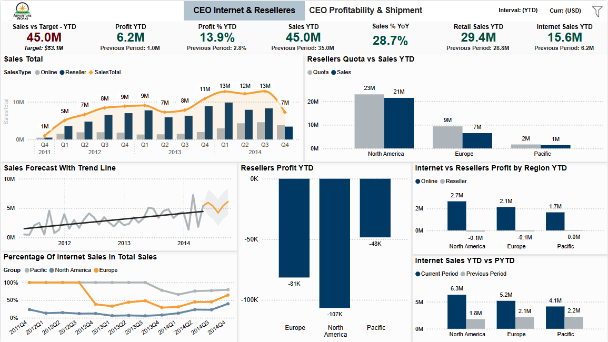

# CEO Dashboard Insights: Internet, Resellers, Profitability & Shipping

## Adventure Works CEO Dashboard Overview

### Introduction and Business Objectives

The **Adventure Works CEO dashboards** provide C-level executives with a unified overview of sales performance, profitability, and operational efficiency. The main objectives are:

- Assessing sales targets and growth trends  
- Comparing performance across sales channels (Internet vs. Reseller)  
- Reviewing regional and segment-level results  
- Ensuring customer satisfaction through on-time delivery

The dashboards are built to help the CEO:
- Track progress against targets  
- Review YoY trends, including seasonal effects  
- Drill into results by region, channel, product, or customer  
- See Internet & Reseller performance in one consolidated view  
- Monitor profit margins and the drivers/detractors of profitability  
- Track operational KPIs like on-time shipments

---

## Dashboard 1: CEO Internet & Resellers

### Purpose

This dashboard provides a **one-page summary** of all key sales metrics and trends, with an emphasis on the contribution of each channel (Internet vs. Reseller) and regional breakdowns. The design delivers a fast, comprehensive view of performance, channel mix, and regional strengths/weaknesses.

---

### KPI Overview (Sales & Profit Performance)

- **Key metrics at a glance:**  
  - **Sales vs Target (YTD):** $45.0M (Target: $53.1M)  
  - **Profit YTD:** $6.2M  
  - **Profit % YTD:** 13.9% (Prev. 2.8%)  
  - **Sales % YoY:** +28.7%  
  - **Retail (Reseller) Sales YTD:** $29.4M  
  - **Internet Sales YTD:** $15.6M (Prev. $6.2M)  

- **Color coding:**  
  - **Dark green:** Improvement  
  - **Dark red:** Underperformance

- **Business Questions Answered:**  
  - Are we on track for our sales goals?  
  - How do we compare to last year?  
  - How are Internet and Reseller channels performing side by side?

---

### Sales Trends & Channel Comparison

- **Quarterly sales trend (2011 Q4 – 2014 Q4):**  
  - Clustered bar & line chart:  
    - **Blue bars:** Online sales  
    - **Gray bars:** Reseller sales  
    - **Orange line:** Sales total  
  - Sales peaked Q4 2013–Q1 2014 (~$13M), with a seasonal dip Q4 2014 ($7M).
  - **Channel mix:** Internet share increases over time, illustrating the shift toward online sales.

---

### Regional Performance (Quota, Sales & Profit)

- **Resellers Quota vs Sales YTD:**  
  - *North America:* $21M sales vs $23M quota  
  - *Europe:* $7M sales vs $9M quota  
  - *Pacific:* $1M sales vs $2M quota  

- **Resellers Profit YTD:**  
  - All regions are negative:  
    - *North America:* –$107K  
    - *Europe:* –$81K  
    - *Pacific:* –$48K  

- **Internet vs Resellers Profit by Region YTD:**  
  - Internet is profitable in all regions (e.g., NA: $2.7M), while Reseller profits are negative or near zero.

- **Internet Sales YTD vs PYTD (by region):**  
  - *North America:* $6.3M (Current) vs $1.8M (Previous)  
  - *Europe:* $5.2M vs $2.1M  
  - *Pacific:* $4.1M vs $2.2M  

---

### Sales Forecast & Trend

- **Sales Forecast with Trend Line:**  
  - Historical monthly sales with 5-month forward forecast  
  - Black line: actuals, orange: forecast, gray band: 95% confidence interval  
  - Upward trend, forecast continues growth but with wider uncertainty

---

### Internet Sales Mix by Region

- **Internet Sales Ratio in Total Sales (by region):**  
  - Line chart shows increasing online share in all markets  
  - North America nearing 50% of sales from Internet  
  - Europe and Pacific also trending upward

---

### Interactive Filters

- **Filter panel for:**  
  - Timeframe (default: YTD)  
  - Currency (default: USD)  
  - Region  
- Allows drill-down and easy context switch for data exploration

---

## Key Insights

- **Sales Target Shortfall:**  
  - YTD sales ($45.0M) below target ($53.1M), but strong 28.7% YoY growth

- **Explosive Online Growth:**  
  - Internet Sales YTD more than doubled vs previous year ($15.6M vs $6.2M)

- **Reseller Channel Weakness:**  
  - Reseller profits negative across all regions (–$0.2M overall YTD)
  
- **Regional Standouts:**  
  - North America is the biggest market, leading in sales and online profit  
  - NA is approaching 50% Internet sales share

- **Upward Trend with Seasonal Variability:**  
  - Despite a dip in Q4 2014, overall growth trajectory is strong  
  - Forecast suggests continued improvement

---

## Value Delivered

The CEO dashboards enable:
- Fast comparison of Internet vs. Reseller sales and profits  
- Deep dives by region, channel, and time period  
- Clear identification of strengths (Internet growth, NA leadership) and risks (Reseller losses, missed targets)
- Strategic planning with integrated sales and profit forecasting

---

*For more details, see dashboard image above or refer to the Power BI report.*
